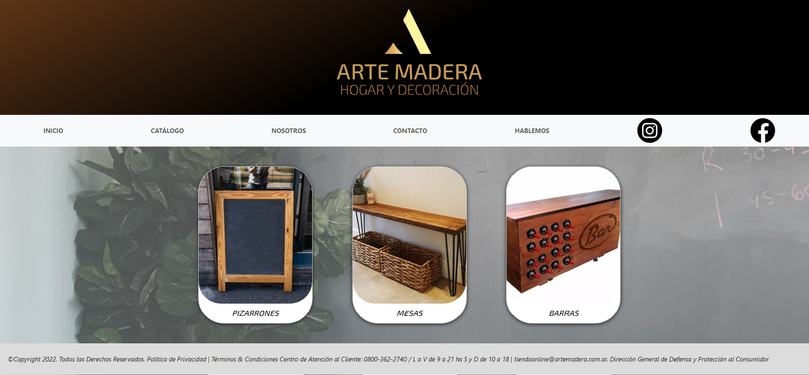
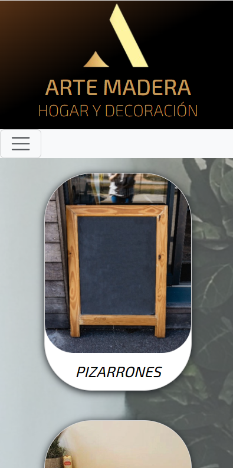

# Arte Madera - Página Web de Ecommerce

## Descripción del proyecto.
Arte Madera es una página web de ecommerce que presenta una variedad de muebles de madera artesanales. La plataforma ofrece una amplia gama de productos, desde mesas, sillas y barras.

## Profesor
Maximiliano Cardenas

## Instalación
1. Clona el repositorio desde GitHub: https://github.com/RodrigoPavezR/pf-pavez
2. Abre el proyecto en tu editor de código favorito.

## Uso
Una vez que hayas instalado el proyecto, podes navegar por la página web para explorar los distintos muebles de madera disponibles. El diseño es completamente responsive, para ofrecer una experiencia óptima tanto en desktop como en mobile.

## Tecnologías Utilizadas
- HTML 
- SCSS y CSS
- Bootstrap (para el navbar)
- Git (para el control de versiones)

